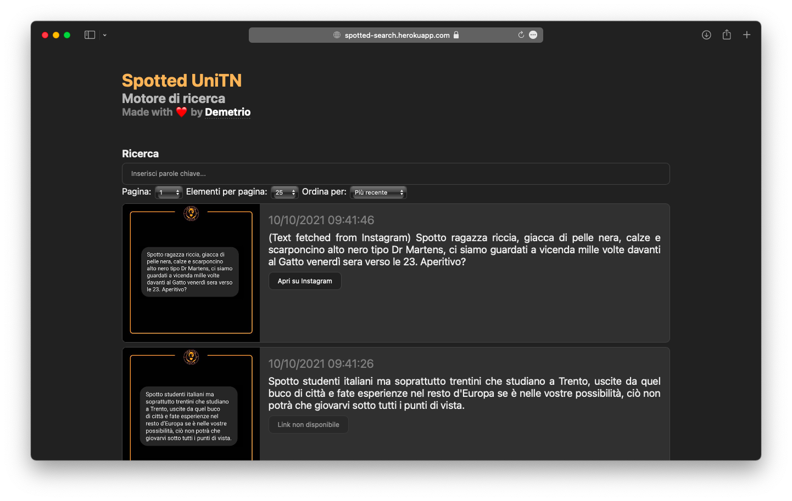

# frontend-spotted-unitn
Motore di ricerca dei post di spotted_unitn. Dati ottenuti con riconoscimento del testo attraverso Tesseract OCR, dando priorità al riconoscimento integrato di Instagram laddove presente.

